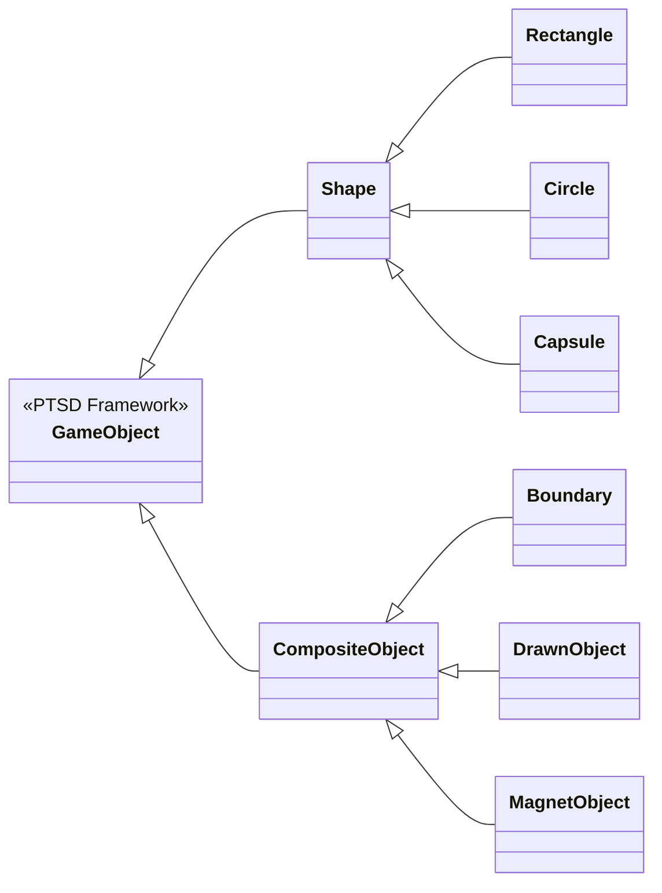
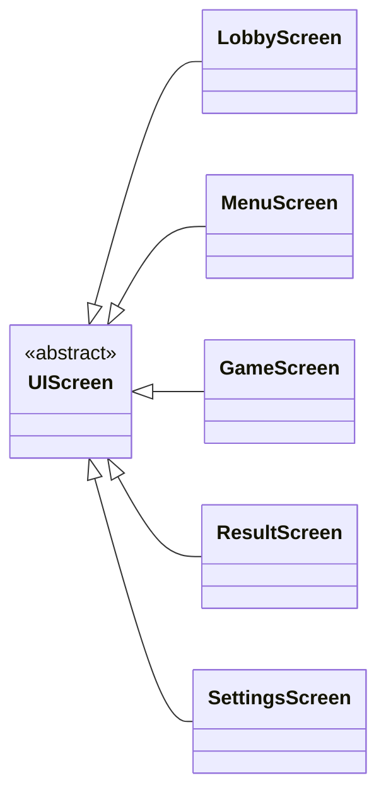
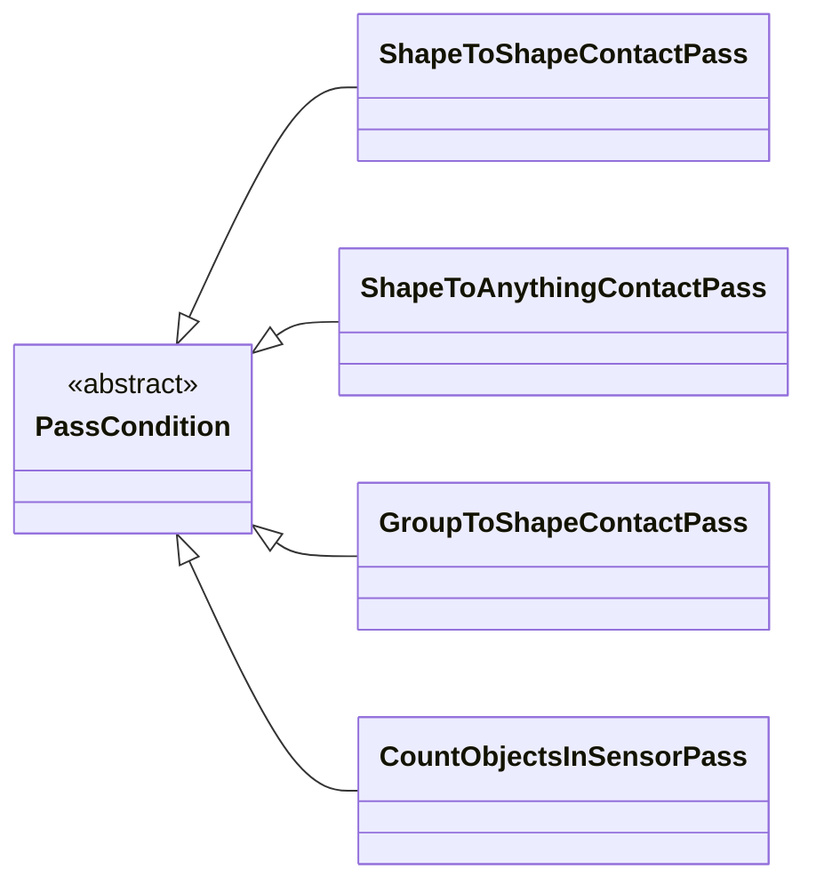
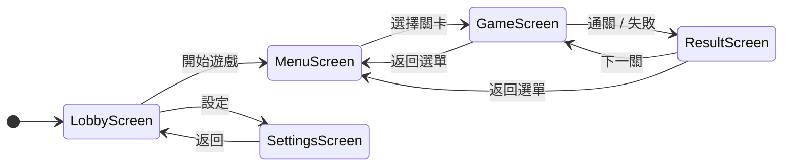
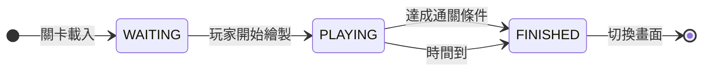
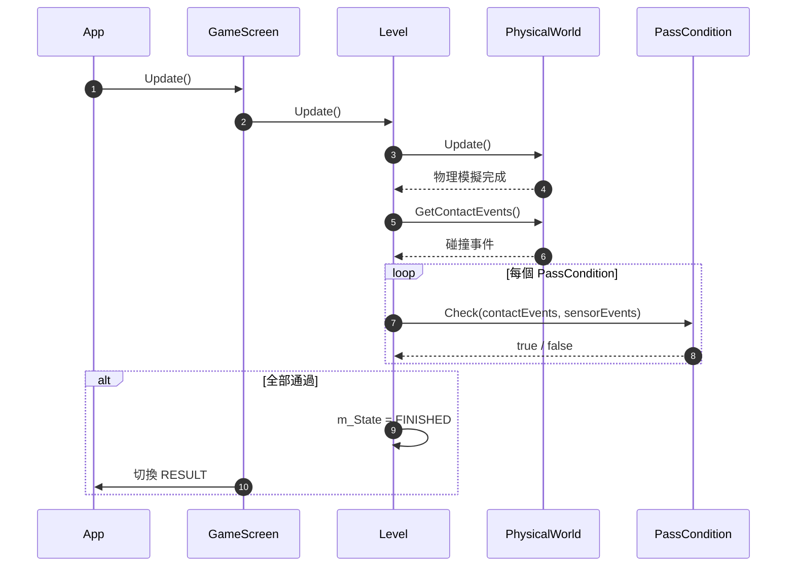

# 2026 OOPL Final Report

## 組別資訊

組別：T39
組員：113820025 黃佳葆、113820026 陳柏希
復刻遊戲：Brain it On!

## 專案簡介

### 遊戲簡介

Brain it On! 是一款 2D 物理益智遊戲。玩家在遊戲畫面中以滑鼠繪製線條或形狀，利用重力、碰撞與摩擦力等物理原理，使場景中的物體產生互動，進而達成各關卡的目標（例如讓兩個物體接觸、將球體放入容器、使物體離開容器等）。遊戲以最少筆畫、最短時間為評分標準，無法達成目標則獲得 0 顆星

本專案為 Brain it On! 的 C++ 復刻版，使用 **PTSD（Practical Tools for Simple Design）v0.2** 作為渲染與輸入框架，**Box2D v3.1.1** 作為物理引擎，以 **CMake ≥ 3.16** 建置，支援 **C++17** 標準。遊戲包含 15 關，難度由淺入深，涵蓋基本繪畫、槓桿平衡、禁止區域、物體計數、磁力、多米諾骨牌等多種機制。

### 組別分工

| 組員 | 學號 | 負責範圍 |
|------|------|----------|
| 黃佳葆 | 113820025 | 核心架構（App、UIScreen 狀態機）、物理世界（PhysicalWorld、CompositeObject、Shape）、關卡系統（Level、PassCondition）、關卡配置（Level 1~15）、記憶體管理 |
| 陳柏希 | 113820026 | UI 畫面（LobbyScreen、MenuScreen、ResultScreen、SettingsScreen）、進度存檔（ProgressStore）、截圖系統（Screenshot）、HUD 系統（LevelHUD）、座標轉換（CoordinateHelper）、資源管理 |

## 遊戲介紹

### 遊戲規則

1. **繪製機制**：玩家以滑鼠拖曳在畫面中繪製線條，線條會轉化為具有物理屬性的剛體物件。每關有筆畫次數限制，超出則扣一顆星。
2. **物理模擬**：遊戲使用 Box2D v3 物理引擎，物件受重力、碰撞、摩擦力影響而運動。畫面座標原點為中心，右為正 X、上為正 Y，像素與物理公尺的轉換比例為 50 px/m。
3. **通關條件**：每關設有一個或多個通關條件，包含：
   - **ShapeToShapeContactPass**：兩個特定形狀接觸（或分離）持續指定時間
   - **ShapeToAnythingContactPass**：某形狀與任意其他形狀接觸（或分離）持續指定時間
   - **GroupToShapeContactPass**：一組形狀中的任一形狀與目標形狀接觸
   - **CountObjectsInSensorPass**：指定數量物件位於感測器區域內
4. **計時系統**：每關有時間限制（8~30 秒不等），倒數歸零時若未達成通關條件則扣一顆星。
5. **評分系統**：三星制——通關得一星、在時間內通關得二星、在筆畫限制內通關得三星。最佳紀錄以 CSV 格式存檔。
6. **特殊機制**：
   - **禁止區域（Forbidden Zone）**：部分關卡中，特定區域禁止玩家繪製
   - **磁力（Magnetism）**：磁力物件會吸引或排斥其他磁力物件
   - **感測器（Sensor）**：不產生物理碰撞但能偵測物體進入的區域

### 遊戲界面

遊戲共有五個主要界面，流程如下：

```
LobbyScreen → MenuScreen → GameScreen → ResultScreen
                  ↑              ↓            ↓
                  └──────────────┴────────────┘
```

- **LobbyScreen**：遊戲入口界面，展示物理沙盒場景，玩家可自由繪製體驗物理效果
- **MenuScreen**：關卡選擇界面，顯示 15 關的進度與星等，玩家點擊即可進入關卡
- **GameScreen**：遊戲主界面，上方顯示倒數計時器與通關目標提示，左側有返回按鈕，右側有重試按鈕
- **ResultScreen**：結果界面，顯示通關/失敗結果、用時、筆畫數，並提供「下一關」與「返回」按鈕
- **SettingsScreen**：設定界面

## 程式設計

### 程式架構

```
main.cpp
  └── Core::Context（遊戲主迴圈）
        └── App（狀態機：START → UPDATE → END）
              └── UIScreen（畫面基類）
                    ├── LobbyScreen（入口沙盒）
                    ├── MenuScreen（關卡選擇）
                    ├── GameScreen（遊戲主畫面）
                    │     └── Level（關卡狀態機：WAITING → PLAYING → FINISHED）
                    │           ├── PhysicalWorld（物理世界）
                    │           │     ├── CompositeObject（複合物件）
                    │           │     │     ├── Boundary（邊界牆壁）
                    │           │     │     ├── DrawnObject（玩家繪製物件）
                    │           │     │     └── MagnetObject（磁力物件）
                    │           │     ├── Shape（形狀基類）
                    │           │     │     ├── Rectangle（矩形）
                    │           │     │     ├── Circle（圓形）
                    │           │     │     └── Capsule（膠囊形）
                    │           │     └── DrawingIndicator（繪製指示器）
                    │           ├── PassCondition（通關條件基類）
                    │           │     ├── ShapeToShapeContactPass
                    │           │     ├── ShapeToAnythingContactPass
                    │           │     ├── GroupToShapeContactPass
                    │           │     └── CountObjectsInSensorPass
                    │           └── LevelHUD（關卡 HUD）
                    ├── ResultScreen（結果畫面）
                    └── SettingsScreen（設定畫面）
```

**(1) 遊戲實體：`Util::GameObject` 繼承樹**



**(2) 畫面系統：`UIScreen` 繼承樹**



**(3) 通關條件：`PassCondition` 繼承樹**



**(4) 畫面狀態移轉**



**(5) 關卡狀態移轉**



**(6) 通關條件檢查流程**



**核心設計模式**：

- **狀態機（State Machine）**：App 以 `State` 列舉管理遊戲狀態；Level 以 `State` 管理關卡狀態；UIScreen 以 `ScreenType` 管理畫面切換
- **策略模式（Strategy Pattern）**：`PassCondition` 為抽象基類，各子類實作不同通關策略，Level 可同時持有多個策略
- **靜態註冊模式（Static Registration）**：各關卡透過匿名 namespace + static 物件自動註冊至全域 `LevelRegistry`，新增關卡無需修改其他程式碼
- **組合模式（Composite Pattern）**：`CompositeObject` 組合多個 `Shape` 形成剛體，`PhysicalWorld` 組合多個 `CompositeObject` 形成物理場景

### 程式技術

| 技術 | 說明 |
|------|------|
| **C++17** | 使用 `std::optional`、`std::variant`、`if constexpr` 等 C++17 特性 |
| **Box2D v3** | 使用 handle-based API（`b2WorldId`、`b2BodyId`、`b2ShapeId`），非傳統物件導向 API |
| **PTSD v0.2** | 封裝 SDL2 的渲染、輸入、音訊、資源管理，避免直接操作底層 API |
| **CMake + FetchContent** | 自動拉取 Box2D、nlohmann/json、PTSD 等外部依賴，無需手動安裝 |
| **Smart Pointer** | 全面使用 `std::shared_ptr` / `std::unique_ptr`，避免記憶體洩漏 |
| **Lambda 表達式** | UI 按鈕的回呼使用 Lambda 閉包，簡化事件處理 |
| **CSV 存檔** | 進度資料以 CSV 格式儲存，支援跨平台讀寫 |
| **截圖系統** | 利用 SDL2 的像素讀取功能，在通關時自動截圖並儲存 |
| **層次渲染（Layer System）** | 10 個渲染層級（Background → LevelBackGround → ForbiddenZone → ShapeOutLine → Shape → DrawnObject → UIBackground → UIOutline → UIElement → UIElementHUD），確保物件正確疊蓋 |

### 使用到 AI/AI Agent 的部分

- **程式碼生成**：使用 AI 輔助產生 Box2D v3 的碰撞事件處理程式碼、物理參數調校、以及部分 UI 元件的實作
- **API 查閱**：Box2D v3 的 handle-based API 與傳統的物件導向 API 差異較大，使用 AI 協助理解 `b2World_GetContactEvents`、`b2Body_SetPosition` 等函式的正確用法
- **問題排查**：針對物理模擬中的不穩定現象（如物件穿模、爆炸式碰撞），使用 AI 分析可能的原因與解決方向

## 結語

### 問題與解決方法

| 問題 | 解決方法 |
|------|----------|
| **Box2D v3 API 不熟悉** | Box2D v3 採用 C-like handle API（`b2WorldId`、`b2BodyId`），與 v2 的物件導向 API 差異極大。透過 AI 輔助與反覆查閱官方文件，逐步理解 `b2World_GetContactEvents`、`b2Body_SetPosition` 等函式的用法，並建立 `CoordinateHelper` 封裝像素↔公尺轉換 |
| **靜態初始化順序問題** | 關卡註冊使用全域 static 物件，不同編譯單元的 static 初始化順序未定義。改用函式返回 `std::map<LevelId, LevelFunction>` 的方式，確保 map 在使用前已完全初始化 |
| **物理模擬不穩定** | Level 15 多米諾骨牌場景中，初始碰撞導致物件爆炸式飛散。在相鄰物件間加入微小間隙（`GAP_X = 0.2F`、`GAP_Y = 0.1F`），避免 Box2D 在初始時偵測到多重重疊碰撞 |
| **記憶體管理** | 大量使用 `std::shared_ptr` 管理物件生命週期，`UIScreen` 使用 `std::unique_ptr` 確保單一擁有者。截圖檔案在未成為最佳紀錄時自動刪除，避免孤兒檔案 |
| **禁止區域實作** | 利用 Box2D 的 Sensor 機制，將禁止區域設為 Sensor，在 `PhysicalWorld` 中維護 `m_ForbiddenShapeIds` 列表，繪製時檢查滑鼠位置是否在禁止區域內 |

### 自評

|項次| 項目                                     | 完成 |
|----| ---------------------------------------- | ---- |
| 1| 這是範例                                 | V    |
| 2| 完成專案權限改為 public                  | V    |
| 3| 具有 debug mode 的功能                   | V    |
| 4| 解決專案上所有 Memory Leak 的問題        | V    |
| 5| 報告中沒有任何錯字，以及沒有任何一項遺漏 | V    |
| 6| 報告至少保持基本的美感，人類可讀         | V    |

### 心得

這次的專案是我們兩人第一次合作完成一個完整的遊戲，過程中最深刻的體會就是「分工」與「整合」同樣重要。我們在初期就明確劃分了各自的負責範圍——佳葆負責核心架構、物理世界與關卡系統，柏希則負責 UI 畫面、存檔系統與 HUD。這樣的分工讓我們能夠各自專注在自己的模組上平行開發，大幅提升了效率。

然而，真正的挑戰在於兩人的程式碼要整合在一起的時候。例如 GameScreen 需要同時呼叫 Level（佳葆負責）和 LevelHUD（柏希負責），介面設計上需要反覆溝通才能確保彼此的模組能夠無縫銜接。我們透過事先約定好類別的公開介面（如 Level 暴露哪些狀態供 HUD 讀取、PhysicalWorld 提供哪些資訊給 UI 顯示），才讓整合過程順利許多。這讓我們體會到，良好的介面設計不只是技術問題，更是團隊協作的基礎。

另外，AI 工具在這次開發中扮演了不可或缺的角色。Box2D v3 的 handle-based API 我們比較不熟悉，而 AI 幫助我們快速理解了 b2World_GetContactEvents、b2Body_SetTransform 等函式的正確用法，節省了大量查閱文件的時間。在遇到物理模擬不穩定的問題時，AI 也協助我們分析可能的原因並提供解決方向。更重要的是，AI 在程式碼審查與重構方面給了我們很多建議，例如記憶體管理策略、設計模式的選用等，讓我們的程式碼品質提升了不少。可以說，AI 就像是我們團隊中的第三位成員，隨時提供技術支援與建議。

總結來說，這次專案讓我們學到的不只是物件導向和物理引擎的技術，更重要的是如何在團隊中有效溝通、如何設計可整合的模組介面，以及如何善用 AI 工具來加速開發與學習。這些經驗對我們未來的軟體開發之路將會非常受用。

### 貢獻比例

| 組員 | 貢獻比例|
| --- | --- |
| 黃佳葆 | 50 % |
| 陳柏希 | 50 % |
